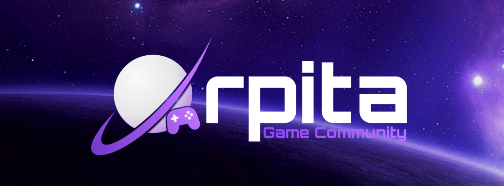
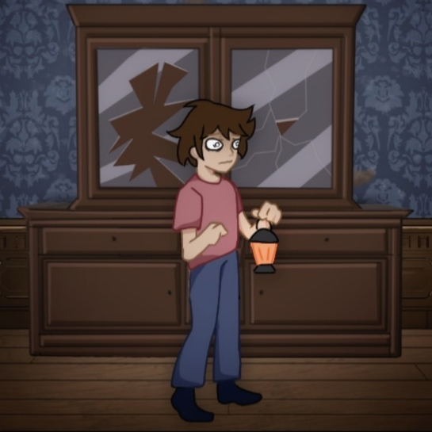
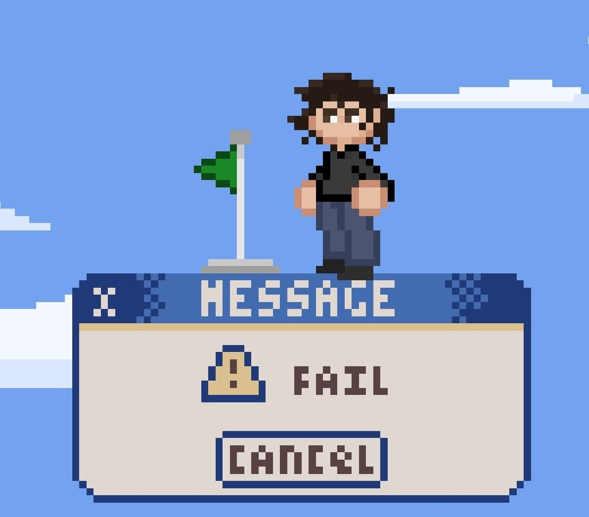
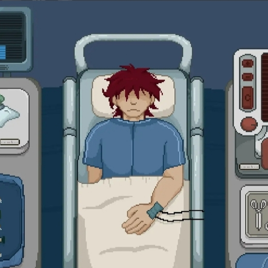

  # HI, I'm Amr Elmahdy 
**Founder of Orpita Game Community · Creator of Jurdian Project · Co-Founder at Black Cat Digital Studio**
***

## About Me

I'm a Business Administration student specializing in HR, the founder of **Orpita Game Community**, and the creator of the **Jurdian Project**.

I'm passionate about the **game development industry** and interested in learning **web development**. I enjoy building different projects, exploring new ideas, and turning concepts into real experiences.

---

## What I'm Working On

- **Jurdian Wiki** — Building a Ciphers wiki for the Jurdian Project.
- **Orpita Community Website** — Building a new website for the Orpita Game Community.
- 
## Skills & Tools

### Web Development

### Productivity & Other Tools

---

## Orpita Game Community

**Orpita** is a volunteer-based game development community built around collaboration, learning, and creating games together.

### My Role

I'm the **Founder of Orpita**, where I help build and manage the community, organize its activities, and contribute to its projects and development.

### Games & Projects

<table>
<tr>
<td width="30%" align="center" valign="top">
  

&nbsp;

</td>
<td width="70%">
<h3>The Last Lantern</h3>

A 2D side-scrolling horror exploration game built around a unique 20-second lantern mechanic.

Made in 96 hours for <b>GMTK Game Jam 2026</b> Theme: <b>Countdown</b>

🏆 <b>#569 / 10,400+ games</b> 🥇 <b>Top 5% Overall</b> 📖 Top 3% Narrative · 🔊 Top 6% Audio · 🎨 To p 8% Artwork

</td>
</tr>
</table>
<table>
<tr>
<td width="30%" align="center" valign="top">
  

&nbsp;

</td>
<td width="70%">
<h3>Rewind</h3>

A retro-inspired platforming adventure set inside a corrupted digital world.

Made in 96 hours during the <b>Orpita Mini Game Jam 2026</b>.

💾 <b>Retro Platforming</b> · 👾 <b>Virus-themed World</b> · 🎵 <b>Original Audio</b>

</td>
</tr>
</table>
<table>
<tr>
<td width="30%" align="center" valign="top">
  

&nbsp;

</td>
<td width="70%">
<h3>One More Day</h3>

A narrative-driven experience following a young doctor through a hospital shift that quickly turns into a race against time.

Made in 96 hours for <b>GMTK Game Jam 2025</b> Theme: <b>Loop</b>

📖 <b>Narrative-driven</b> · 🏥 <b>Hospital Setting</b> · 🎵 <b>Original Audio</b>

</td>
</tr>
</table>

---